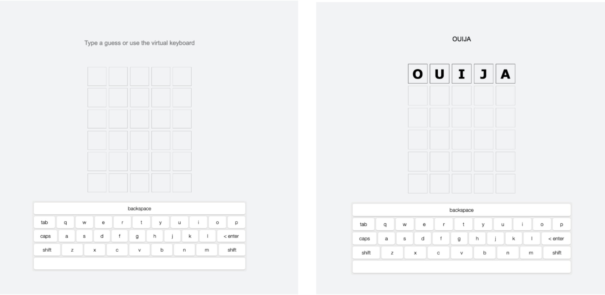
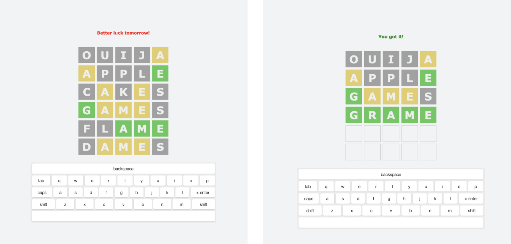
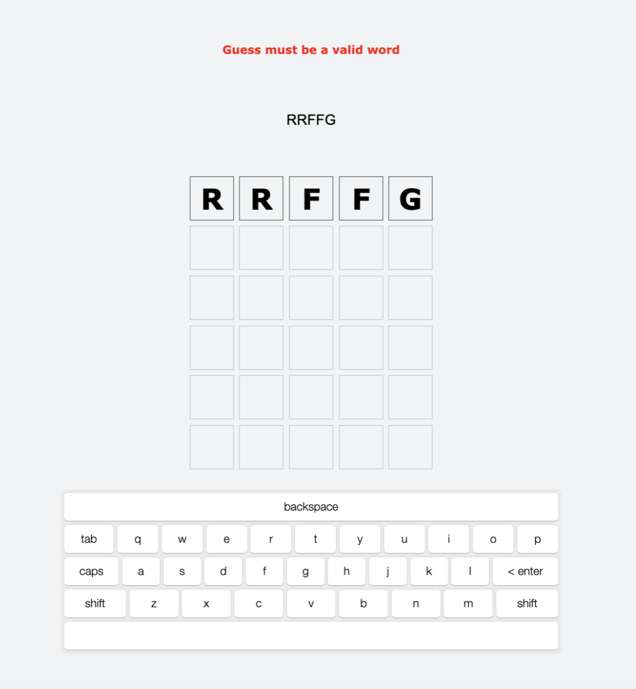

# Wordle Clone

## Overview

- A Wordle clone built with a React/TypeScript frontend and a Python/FastAPI backend. Players have 6 attempts to guess a 5-letter word of the day, with color-coded tile feedback after each guess: green (correct position), yellow (wrong position), grey (not in word).

  
  
  

### Tech Stack

Frontend

- React 19 + TypeScript, built with Vite
- Tailwind CSS + Material-UI for styling
- Axios for API communication
- react-simple-keyboard for the on-screen keyboard

Backend

- Python + FastAPI
- Uvicorn server

## Features

- The word of the day is selected deterministically using a date-based seed (YYYYMMDD) via GET /word, so every player gets the same word.
- Guesses are submitted via POST /guess to the backend, which validates the input against a static word list and runs a two-pass algorithm to correctly handle duplicate letters.
- For this project, the backend is stateless, so no session storage is needed.

## Backend Setup

### Prerequisites

- Python 3.9+

### Installation

1. Navigate to the backend directory:

   ```bash
   cd backend
   ```

2. Create and activate a virtual environment:

   ```bash
   python3 -m venv venv
   source venv/bin/activate  # On Windows: venv\Scripts\activate
   ```

3. Install dependencies:
   ```bash
   pip install -r requirements.txt
   ```

### Running the Server

```bash
uvicorn main:app --reload
```

The API will be available at `http://127.0.0.1:8000`.

## Frontend Setup

### Prerequisites

- Node.js 18+ (or compatible version)
- npm

### Install

1. Navigate to the frontend directory:
   cd frontend
2. Install dependencies:
   npm install

### Run locally

`
npm run dev

Open the local Vite URL shown in the terminal (typically `http://localhost:5173`).

### Build for production

```bash
npm run build
```

### Notes

- The frontend uses `frontend/package-lock.json`.
- Only commit/push `frontend/package-lock.json` when updating frontend dependencies.

## Our Team

- Jackie: [GitHub](https://github.com/jackie-leary) / [LinkedIn](https://www.linkedin.com/in/jacqueline-bail-9a708111b/)
- Jaynie: [GitHub](https://github.com/jaynie12) / [LinkedIn](https://www.linkedin.com/in/jaynie-shah/)
- Bruno: [GitHub](https://github.com/jecurb) / [LinkedIn](https://linkedin.com/in/bajohnson9)
